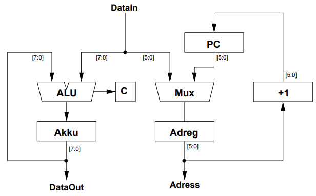
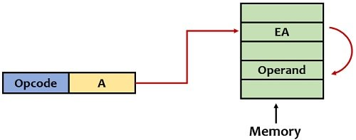
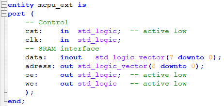
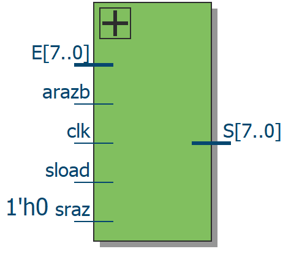
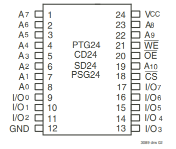
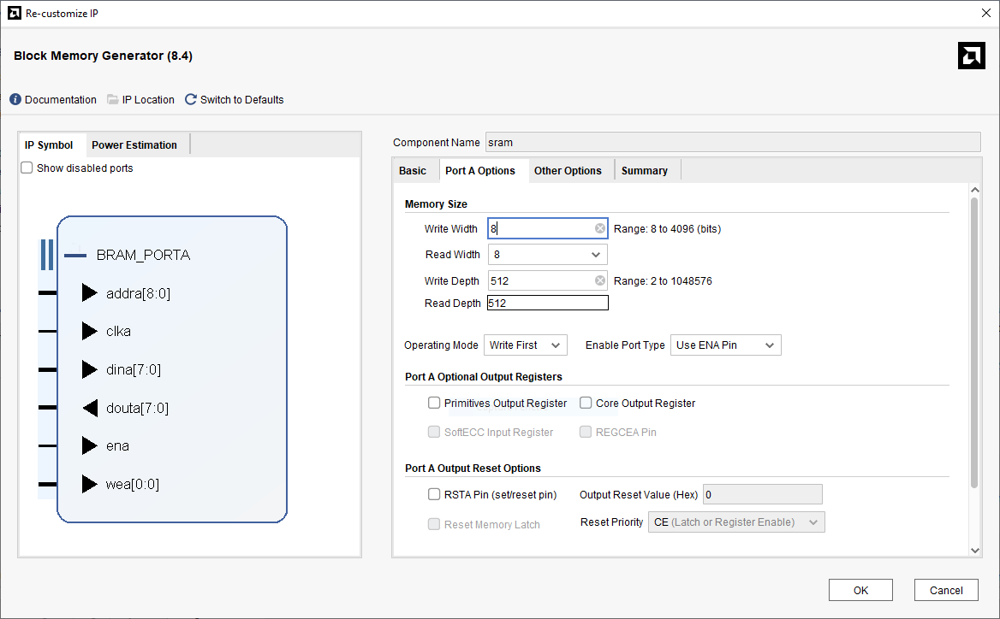
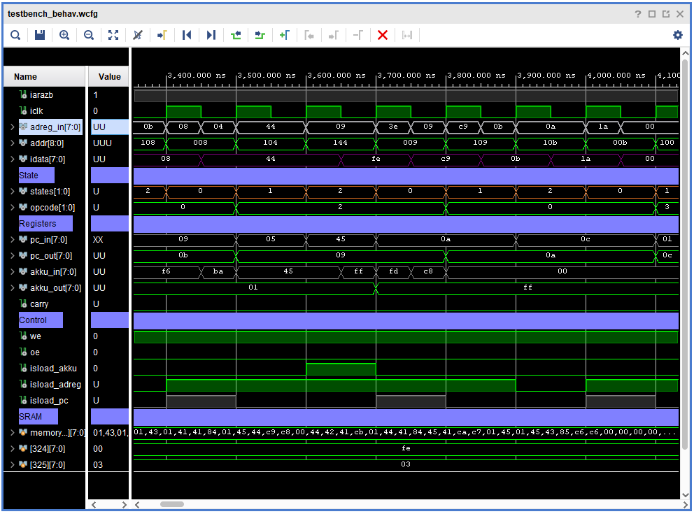

<!-- Template from https://github.com/othneildrew/Best-README-Template -->
<a id="readme-top"></a>


<!-- PROJECT LOGO -->
<div align="center">
  <h2 align="center">MCPU Extended Adressing</h2>

  <p align="center">
    This is a indirect memory adressing version of the <a href="https://github.com/cpldcpu/MCPU">MCPU</a> 8 bit CPU, and total overhauled VHDL implementation for explicit control lines logic expressions.
    <br />
  </p>
</div>


[![Github][github]][github-url]
![Python][python]

Original MCPU: [https://github.com/cpldcpu/MCPU](https://github.com/cpldcpu/MCPU)

<!-- TABLE OF CONTENTS -->
<summary>Table of Contents</summary>
<ol>
  <li><a href="#about-the-project">About The Project</a></li>
  <li><a href="#original-mcpu">Original MCPU</a></li>
  <li>
    <a href="#architecture">Getting Started</a>
    <ul>
      <li><a href="#indirect-memory-addressing">Indirect memory addressing</a></li>
      <li><a href="#memory-banking">Memory banking</a></li>
    </ul>
  </li>
  <li>
    <a href="#vhdl-implementation">VHDL implementation</a>
    <ul>
      <li><a href="#SRAM trouble">SRAM trouble</a></li>
      <li><a href="#simulation">Simulation</a></li>
    </ul>
  </li>
    <li>
    <a href="#emulator">Emulator</a>
    <ul>
      <li><a href="#converting-to-indirect-addressing">Converting to indirect addressing</a></li>
      <li><a href="#test-program">Test program</a></li>
    </ul>
  </li>
  <li><a href="#licence">Licence</a></li>
</ol>


<!-- ABOUT THIS PROJECT -->
## About The Project

The internet is full of amazing TTL and discrete transistor computer
projects. I’ve always been fascinated by these seemingly impractical yet
captivating displays of ground-up electronics design. This led me to
consider how I might go about designing my own "homemade CPU."  
One design that caught my eye was a pair of projects by Tim called the
[MCPU](https://github.com/cpldcpu/MCPU) and
[LCPU](https://hackaday.io/project/169948-lcpu-a-cpu-in-led-transistor-logic-ltl).
The first is a minimal CPU architecture for which he created a VHDL
implementation, along with an assembler and emulator. The latter is a
discrete component design using a variant of this CPU.  
I found his work particularly well explained, making it an excellent
starting point. The instruction set was exactly what I had in mind -
small enough to keep complexity down, yet capable of running a "real"
program. As for the physical design, which uses DTL (Diode Transistor
Logic) with LEDs integrated into the logic, I consider it almost a work
of art. Feel free to disagree.

## Original MCPU

<figure id="fig:original_architecture" align="center">

<figcaption>Original MCPU architecture</figcaption>
</figure>

With a 6 bit address register this design can address 64 bytes of
memory. While this minimal CPU is intended as an educational tool
primarily due to its limitations, the only real part holding it back is
its memory size. There is only so much you can do with 64 bytes.  
The main goal of this study is to improve on this initial design by
extending the memory, while keeping the same instruction set and 8 bit
data bus.

<u>Instruction set:</u>
| Mnemonic | Opcode   | Description                                      |
|----------|----------|--------------------------------------------------|
| NOR      | 00AAAAAA | Accu = Accu NOR mem[AAAAAA]                      |
| ADD      | 01AAAAAA | Accu = Accu + mem[AAAAAA], update carry          |
| STA      | 10AAAAAA | mem[AAAAAA] = Accu                               |
| JCC      | 11DDDDDD | Set PC to DDDDDD when carry = 0, clear carry     |


## Architecture

In order to extend the addressable memory space, the address bus size
obviously has to increase. Given that the data bus is 8 bits wide, it
seems logical to increase the address bus to 8 bits as well. This would
give 256 bytes of program memory which is already a big leap forward and
plenty for actual real world applications.  
For reference there are commercially available microprocessors with 512
bytes of program memory such as the ATTINY4. Keep in mind that this does
not directly compare because it has 54 instructions which allows for
more complex programs with the same amount of memory.  

### Indirect memory addressing

Increasing the address register size would require the instructions to
be 10 bits (2 bit opcode + 8 bit address), breaking compatibility with
standard 8 bit SRAM chips. To solve this problem the memory addressing
mode is changed to **indirect addressing**, which allows the address
register to be loaded from the data bus instead of the operand. Tim made
a similar change for his LCPU design, allowing for the address register
to be loaded from the accumulator.

<figure id="fig:indirect_mode" align="center">

<figcaption>Indirect addressing mode</figcaption>
</figure>

The address in the operand (A) points to a vector table in memory
containing the effective address (EA) which in turn points to the
desired memory location. While the pointer address A is still 6 bit, the
effective address EA is 8 bits and therefore allows to address a 256
byte SRAM.  
Even though the vector table is limited to 64 bytes, with some
creativity it is possible to fully utilize the memory (like incrementing
the pointers in the vector table to work on arrays).

### Memory banking

While 256 bytes is already a great improvement, a very simple
modification requiring little to no logic resources allows us to achieve
512 bytes of addressable memory (2x256 bytes): a 9th bit will switch
between 2 memory zones depending on the current status. This 9th bit
doesn’t require to increase the address register as it uses the status
register, and thereby only requires a few logic gates.

| Address |          Area          |   Size    |
|:-------:|:----------------------:|:---------:|
| 0x0000  |     Program memory     | 256 bytes |
| 0x00FF  |                        |           |
| 0x0100  |      Vector table      | 64 bytes  |
| 0x010F  |                        |           |
| 0x0110  | General purpose memory | 192 bytes |
| 0x01FF  |                        |           |

## VHDL implementation

The entity of the extended version of the MCPU is near identical to the
basic design. The only difference is the address size which is 9 bits
instead of 6.

<figure id="fig:entity" align="center">

<figcaption>MCPU-ext VHDL entity</figcaption>
</figure>

This is where the similarities end however, as the VHDL implementation
has been completely re-written from scratch. Instead of optimizing for
as few logic cells as possible to fit in a 32 macro-cell CPLD, this new
implementation aims for a better separation of sequential and
combinational logic parts to facilitate the making of a physical TTL
version. This also provides an explicit expression for the control
signals.  
In this spirit, all 3 registers are instances of a generic register and
have the same interface as readily available register ICs. The
accumulator register is reduced to 8 bits by separating the carry bit,
leaving all 3 registers identical.

<figure id="fig:reg_univ_1" align="center">

<figcaption>Universal register</figcaption>
</figure>


### SRAM trouble

If this design were to be implemented with TTL, or even discrete logic,
the SRAM would certainly have to be a dedicated chip. Andrew Starr on
[hackaday](https://hackaday.io/project/11179-ferrite-core-memory-module)
created an amazing core memory module which could be a *somewhat
practical* solution for such an amount of memory. But a more realistic
approach would be the use of a chip like the REN-6116 from RENESAS.

<figure id="fig:entity" align="center">

<figcaption>MCPU-ext vhdl entity</figcaption>
</figure>

With its 11 bit address bus, 2 extra bits can be connected to dip
switches to enable multiple programs to be loaded and chosen from.  
When implementing both the CPU and SRAM on an FPGA a problem arises. The
SRAM above is non-synchronous, and therefore has no clock. But in most
FPGA’s the SRAM is synchronous and is edge triggered.

<figure id="fig:sram_ip" align="center">

<figcaption>SRAM IP</figcaption>
</figure>

### Simulation

In order to simulate the CPU, a testbench has to be created to connect
our CPU to an SRAM from an IP as showed above, as well as clock and
reset signals.

<figure id="fig:simulation_1" align="center">

<figcaption>Simulation</figcaption>
</figure>

The resulting waveforms can than be inspected and compared to the
software emulator output, which after some trial and error eventually
match.  
A thorough simulation would aim at "full coverage". In case of a CPU
however this is nearly impossible due to the number of possibilities for
a 512 byte rom (10<sup>1233</sup> as far as my estimations go). The next
best option is to verify all instructions, and for branching
instructions make sure to cover all cases (we only have to wory about
the JCC instruction).


<!-- EMULATOR -->
## Emulator

### Converting to indirect addressing

The emulator was one of the easiest parts to convert to use indirect
memory addressing. Given that the emulator uses an array as the memory,
all that needs to be done is to replace to index from being the operand
directly, to a "nested" index.  
Original code :

``` python
mem[arg]
```

First I made an intermediate version which didn’t have a "split" memory
layout and was just the MCPU converted to indirect addressing, resulting
in a 256 byte addressable memory space.

``` python
mem[mem[arg]]
```

To achieve the full 512 bytes, the MSB (Most Significant Bit) has to be
set, which is the same as adding 256 like so :

``` python
mem[mem[arg+256]+256]
```

### Test program

First 14 cycles of the prime test program (assembly listing in [assembler/prime.asm](assembler/prime.asm)) :

``` asm
pc,ir,acc,cf:	00	0x01	  0	0
pc,ir,acc,cf:	01	0x43	  0	0
pc,ir,acc,cf:	02	0x01	  2	0
pc,ir,acc,cf:	03	0x41	  0	0
pc,ir,acc,cf:	04	0x41	255	0
pc,ir,acc,cf:	05	0x84	254	1
pc,ir,acc,cf:	06	0x01	254	1
pc,ir,acc,cf:	07	0x45	  0	1
pc,ir,acc,cf:	08	0x44	  3	0
pc,ir,acc,cf:	09	0xc9	  1	1
pc,ir,acc,cf:	10	0xc8	  1	0
pc,ir,acc,cf:	08	0x44	  1	0
pc,ir,acc,cf:	09	0xc9	255	0
pc,ir,acc,cf:	11	0x00	255	0
pc,ir,acc,cf:	12	0x44	  0	0
pc,ir,acc,cf:	13	0x42	254	0
```


<!-- LICENCE -->
## Licence

MCPU original Licence
```
SMAL license:

/* smal32.c   language: C
   copyright 1996 by Douglas W. Jones
                     University of Iowa
                     Iowa City, Iowa  52242
                     USA

   Permission is granted to make copies of this program for any purpose,
   provided that the above copyright notice is preserved in the copy, and
   provided that the copy is not made for direct commercial advantage.

   Note: This software was developed with no outside funding.  If you find
   it useful, and especially if you find it useful in a profit making
   environment, please consider making a contribution to the University
   of Iowa Department of Computer Science in care of:

                     The University of Iowa Foundation
                     Alumni Center
                     University of Iowa
                     Iowa City, Iowa  52242
                     USA
*/
```

<!-- MARKDOWN LINKS & IMAGES -->
<!-- https://www.markdownguide.org/basic-syntax/#reference-style-links -->
[python]: images/badge/python.svg
[github]: images/badge/github.svg
[github-url]: https://github.com
